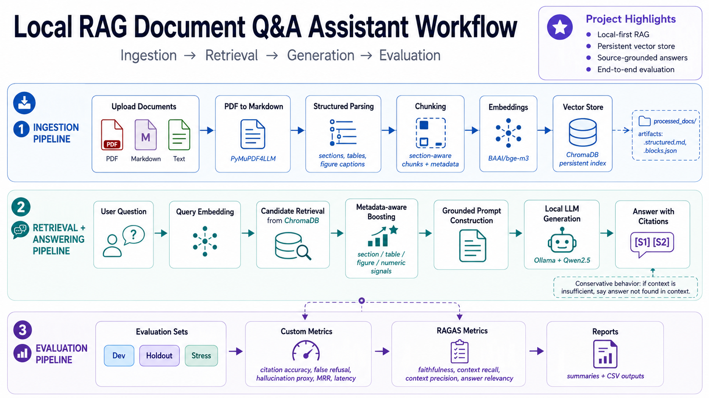

# English RAG Assistant


Local-first Retrieval-Augmented Generation application for English document question answering. The system indexes
academic-style PDFs, retrieves grounded evidence with metadata-aware search, generates cited answers through a local
Ollama/Qwen model, and evaluates quality with RAGAS plus custom RAG metrics.

## Key Results

- Built an end-to-end local RAG pipeline for PDF ingestion, semantic retrieval, grounded answer generation, citation
  display, and evaluation.
- Added document-scoped retrieval so users can query one selected document or search across all indexed documents.
- Evaluated the benchmark document with an 80-question dev/holdout/stress evaluation suite.
- Achieved strong grounded-answer behavior on the benchmark, including holdout Faithfulness above `0.81` and holdout
  Hallucination Rate below `3.5%`.
- Documented engineering tradeoffs around conservative prompting, table/numeric retrieval, figure parsing, and local
  evaluator reliability.

## What This Project Does

English RAG Assistant is a complete local RAG workflow for academic-style documents. A user uploads PDFs or text files,
the app converts and chunks them with useful metadata, stores embeddings in Chroma, retrieves evidence for a question,
and asks a local Ollama/Qwen model to answer only from the retrieved context. The UI supports both single-document and
multi-document search, while the evaluation CLI measures retrieval, generation, citation, refusal, hallucination, and
latency behavior.

The project is intentionally local-first: it avoids hosted LLM APIs, external databases, and heavyweight services so the
whole system can be inspected, run, and evaluated on a laptop.

## Architecture



| Area | Main Files | Role |
|---|---|---|
| App UI | `app.py` | Uploads documents, shows ingestion progress, selects document scope, renders answers and retrieved contexts |
| Ingestion | `rag_mvp/documents.py`, `rag_mvp/pipeline.py` | Converts PDFs to Markdown, creates structured blocks, chunks content, writes local debug artifacts |
| Retrieval | `rag_mvp/vector_store.py` | Embeds chunks, stores them in Chroma, filters by document, and applies metadata-aware boosting |
| Generation | `rag_mvp/ollama_client.py`, `rag_mvp/pipeline.py` | Builds grounded prompts and calls the local Ollama model |
| Evaluation | `rag_mvp/evaluation.py`, `rag_mvp/run_evaluation.py` | Runs custom metrics and RAGAS, then writes merged CSV and Markdown reports |

## Repository Structure

```text
.
|-- app.py                    # Streamlit application
|-- rag_mvp/                  # RAG package: parsing, retrieval, generation, evaluation
|   |-- documents.py          # PDF/text loading, Markdown conversion, structured chunking
|   |-- vector_store.py       # Chroma + embedding search + metadata-aware boosting
|   |-- pipeline.py           # Ingestion, retrieval, prompt construction, answer orchestration
|   |-- evaluation.py         # Custom metrics and RAGAS helpers
|   `-- run_evaluation.py     # Evaluation CLI
|-- evaluation/               # Dev, holdout, and stress evaluation datasets
|-- reports/                  # Saved evaluation results and Markdown summaries
|-- tests/                    # Unit tests for parser, metadata, registry, metrics
|-- requirements.txt          # Python dependencies
`-- pyproject.toml            # Ruff and pytest configuration
```

Generated local artifacts such as `vector_store/`, `processed_docs/`, `.env`, and `.venv/` are ignored so the repository
stays focused on source code, evaluation datasets, and report evidence.

## Setup

Install Python 3.12 and Ollama first.

Pull the default local model:

```powershell
ollama pull qwen2.5:7b
```

Create and activate a virtual environment:

```powershell
py -3.12 -m venv .venv
.\.venv\Scripts\Activate.ps1
pip install -r requirements.txt
```

Start Ollama if it is not already running:

```powershell
ollama serve
```

Run the app:

```powershell
streamlit run app.py
```

Open the Streamlit URL printed in the terminal, usually `http://localhost:8501`.

## Configuration

Runtime settings are configured with environment variables:

```powershell
$env:OLLAMA_MODEL = "qwen2.5:7b"
$env:OLLAMA_BASE_URL = "http://localhost:11434"
$env:OLLAMA_TEMPERATURE = "0.2"
$env:EMBEDDING_MODEL = "BAAI/bge-m3"
$env:CHROMA_COLLECTION = "structured_rag_mvp"
$env:TOP_K = "4"
$env:CHUNK_SIZE = "1000"
$env:CHUNK_OVERLAP = "120"
```

Changing `EMBEDDING_MODEL` requires rebuilding the vector store because embeddings from different models are not
compatible.

## Ingestion Flow

Ingestion is built around reproducibility and debuggability. Each uploaded document receives a stable document ID and a
version hash, so unchanged files can be skipped and changed files can replace their old chunks cleanly. PDFs are first
converted to Markdown with PyMuPDF4LLM, then parsed into structured blocks before chunking and embedding.

| Stage | What Happens | Why It Matters |
|---|---|---|
| Parse | Convert PDF/TXT/Markdown into normalized text and Markdown-like structure | Keeps the pipeline format consistent across input types |
| Structure | Detect sections, tables, figure captions, and content types where possible | Gives retrieval more than raw semantic similarity to work with |
| Chunk | Split content while preserving metadata such as document, page, section, table ID, and figure ID | Makes retrieved sources inspectable and easier to debug |
| Index | Embed chunks with `BAAI/bge-m3` and persist them in Chroma | Enables local semantic search without external services |
| Register | Store version hashes and chunk IDs in a JSON registry | Supports incremental indexing and precise deletion |

The generated `processed_docs/` files are useful during local debugging, but they are ignored by git because they can be
rebuilt from the source documents.

## Retrieval And Answering Flow

At question time, the app embeds the query and searches Chroma for candidate chunks. If the user selected a specific
document, the vector query and metadata scan are filtered to that document ID. Retrieved candidates are then reranked
with lightweight metadata boosts, so queries that mention an abstract, conclusion, table, figure, or numeric value have a
better chance of surfacing the right chunk.

The final contexts are inserted into a grounded prompt for Ollama/Qwen. The model is asked to answer in English, cite
sources as `[S1]`, `[S2]`, and avoid unsupported claims.

The prompt is intentionally conservative: if the retrieved context is insufficient, the model should say that the answer
was not found in the context.

## Evaluation

Evaluation runs as a CLI workflow after the target document has been indexed. The runner first asks the app pipeline to
answer each question, records the retrieved contexts and custom metrics, then runs RAGAS on the same answers and merges
all metrics into one result CSV per dataset.

Run all benchmark splits:

```powershell
python -m rag_mvp.run_evaluation --w18347-all
```

Run a single split when debugging:

```powershell
python -m rag_mvp.run_evaluation --dataset evaluation\w18347_holdout_eval.csv
```

Run several explicit datasets:

```powershell
python -m rag_mvp.run_evaluation --datasets evaluation\w18347_dev_eval.csv evaluation\w18347_holdout_eval.csv evaluation\w18347_stress_eval.csv
```

If the virtual environment is not activated, use the venv Python explicitly:

```powershell
.\.venv\Scripts\python.exe -m rag_mvp.run_evaluation --w18347-all
```

RAGAS runs by default. Use `--skip-ragas` only for quick debugging because Faithfulness, Context Recall, Context
Precision, and Answer Relevancy are core metrics for the final report.

For local Ollama judges, keep RAGAS concurrency low if the evaluator becomes unstable:

```powershell
python -m rag_mvp.run_evaluation --dataset evaluation\w18347_dev_eval.csv --ragas-raise-exceptions --ragas-num-ctx 8192 --ragas-max-workers 1 --ragas-batch-size 1
```

## Evaluation Outputs

Each dataset writes one row-level CSV and one Markdown summary. When several datasets are evaluated together, the runner
also creates a combined summary.

| Output | Example | Contents |
|---|---|---|
| Result CSV | `reports/w18347_holdout_results.csv` | Questions, answers, contexts, custom metrics, and RAGAS metrics |
| Split summary | `reports/w18347_holdout_summary.md` | Core averages, strict averages, valid counts, and segment breakdowns |
| Combined summary | `reports/evaluation_summary.md` | One-table comparison across evaluated splits |

## Metrics

The evaluation combines RAGAS factual QA metrics with custom metrics that expose retrieval, refusal, citation, and
operational behavior.

| Metric Group | Metrics |
|---|---|
| RAGAS generation quality | Faithfulness, Answer Relevancy |
| RAGAS retrieval quality | Context Recall, Context Precision |
| Custom retrieval quality | Evidence Hit Rate, MRR |
| Custom citation quality | Citation Accuracy, Citation Strict Accuracy |
| Custom refusal behavior | Refusal Rate, False Refusal Rate, Refusal Precision, Correct Refusal Behavior |
| Custom reliability and operations | Unsupported Claim Accuracy, Hallucination Rate, Latency |

Hallucination Rate is computed as:

```text
1 - unsupported_claim_accuracy
```

Answerable rows and refusal / not-supported rows are reported separately because RAGAS factual QA metrics are not the
best primary signal for correct refusal behavior.

## Latest Evaluation Snapshot

The benchmark snapshot contains **80 total questions** across dev, holdout, and stress-style evaluation rows for the
showcase document.

| Split | Purpose | Core Readout |
|---|---|---|
| Dev | Retrieval and prompt debugging | Checks whether parser, chunking, retrieval, and citations work before final reporting |
| Holdout | Main portfolio benchmark | Used for headline grounded-answer quality and hallucination reporting |
| Stress | Robustness testing | Tests refusals, unsupported claims, claim verification, and difficult answerable questions |

Headline benchmark results:

| Metric | Result |
|---|---:|
| Holdout Faithfulness | 0.8177 |
| Holdout Answer Relevancy | 0.7498 |
| Holdout Hallucination Rate | 0.0339 |
| Dev Faithfulness | 0.8682 |
| Stress Correct Refusal Behavior | 0.8750 |

Interpretation:

Dev and holdout show solid grounded-answer behavior for a local RAG MVP, with low hallucination on the main benchmark
split. The stress split is intentionally harsher because it mixes answerable questions with refusals, unsupported
claims, and claim-verification prompts. The main known weakness is false refusal on detailed table, definition, and
numeric questions, which points naturally toward table-aware retrieval and reranking as the next iteration.

## Engineering Tradeoffs And Known Limitations

This MVP intentionally favors a transparent local architecture over a heavier production stack.

| Design Choice | Benefit | Tradeoff / Next Step |
|---|---|---|
| Local-first runtime with Ollama, Chroma, local embeddings, and JSON registry | Easy to run without hosted services and transparent enough for portfolio review | Slower than managed inference; a production system would add stronger serving and monitoring |
| Conservative grounded prompt | Keeps hallucination low by forcing answers to come from retrieved context | Can cause false refusals when retrieval misses detailed evidence |
| PyMuPDF4LLM for PDF conversion | Fast, simple, and effective for text-first academic papers | Does not interpret chart pixels or image-only figures |
| Dense retrieval plus metadata-aware boosting | Explainable and easy to debug | Detailed table/numeric queries would benefit from normalized table rows, adjacent chunk expansion, and a reranker |
| Single-document benchmark with multi-document app support | Keeps evaluation controlled while still demonstrating multi-document UX | Formal metrics should be interpreted as benchmark evidence, while multi-document search is an app feature |

## Retrieval Debugging

Use the diagnostic CLI when the answer is wrong but the information appears in `processed_docs/`:

```powershell
python -m rag_mvp.debug_retrieval "what is the abstract?" --document w18347 --skip-vector
```

The output helps isolate whether the problem is:

- PDF-to-Markdown conversion
- section/table/figure metadata parsing
- chunk reconstruction
- Chroma metadata lookup
- vector retrieval and metadata boosting

If parsing or chunks are wrong, reset and re-ingest after parser changes. If metadata matches are correct but final
retrieval is wrong, tune retrieval, boost logic, top-k, or add a reranker.
