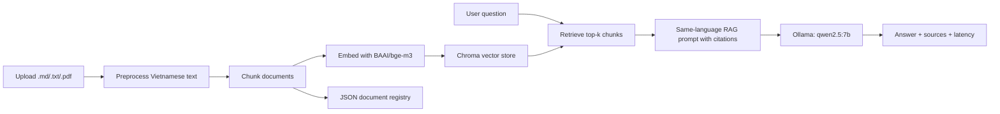

# Multilingual RAG Assistant

Local-first Retrieval-Augmented Generation MVP for Vietnamese and English document Q&A.

This project is designed as a portfolio-ready RAG application: small enough to run locally, but complete enough to show
the full pipeline from ingestion to retrieval, generation, citation, and evaluation.

## Features

- Streamlit app for upload, chat, source inspection, and evaluation.
- Local LLM through Ollama, defaulting to `qwen2.5:7b`.
- Multilingual retrieval with `BAAI/bge-m3`, suitable for Vietnamese and English documents.
- Chroma persistent vector store.
- JSON document registry for incremental indexing and precise chunk deletion.
- Same-language prompting with source citations like `[S1]`: English questions get English answers, Vietnamese questions get Vietnamese answers.
- The answer prompt prevents Chinese fallback responses unless the user explicitly asks in Chinese.
- Evaluation layer with custom MVP metrics and an optional RAGAS core metrics runner.

## Architecture



## Setup

Install Python 3.12 and Ollama first.

Pull the local Qwen model:

```powershell
ollama pull qwen2.5:7b
```

Create a virtual environment and install dependencies:

```powershell
py -3.12 -m venv .venv
.\.venv\Scripts\python -m pip install --upgrade pip
.\.venv\Scripts\pip install -r requirements.txt
```

Start Ollama if it is not already running:

```powershell
ollama serve
```

Run the app:

```powershell
.\.venv\Scripts\streamlit run streamlit_app.py
```

Open the URL printed by Streamlit, usually `http://localhost:8501`.

## Configuration

The app can be configured with environment variables:

```powershell
$env:OLLAMA_MODEL = "qwen2.5:7b"
$env:OLLAMA_BASE_URL = "http://localhost:11434"
$env:EMBEDDING_MODEL = "BAAI/bge-m3"
$env:TOP_K = "4"
$env:CHUNK_SIZE = "1000"
$env:CHUNK_OVERLAP = "120"
```

Changing the embedding model requires rebuilding the vector store because embeddings from different models are not
compatible.

## How It Works

1. Upload `.md`, `.txt`, or `.pdf` files in the sidebar.
2. The loader decodes text with Vietnamese-safe fallbacks and normalizes Unicode to NFC.
3. The chunker splits documents while preserving Vietnamese accents and source metadata.
4. `BAAI/bge-m3` embeds chunks and stores them in Chroma.
5. The JSON registry stores document IDs, version hashes, and chunk IDs.
6. At question time, the app retrieves top-k chunks and builds a same-language prompt.
7. Ollama runs Qwen locally and returns an answer with citations.
8. The UI displays the answer, latency, and retrieved contexts.

## Evaluation

The MVP includes custom evaluation metrics in `rag_mvp/evaluation.py`:

- False refusal rate
- Citation accuracy
- Citation strict accuracy
- Unsupported claim accuracy
- Latency

The optional RAGAS core runner targets:

- Faithfulness
- Answer Relevancy
- Context Precision
- Context Recall

A sample evaluation file is available at `evaluation/sample_eval_set.csv`. Results are saved to
`reports/rag_mvp_eval_results.csv`.

Run evaluation from the Streamlit `Evaluation` tab after indexing documents. Custom metrics run locally. RAGAS core
metrics may require an evaluator LLM/embedding setup supported by your installed RAGAS version.

## JSON Registry

The MVP uses `vector_store/rag_mvp_registry.json` to track indexed documents, version hashes, and Chroma chunk IDs.
This keeps setup simple and avoids database services for a local portfolio demo.

## Project Layout

```text
rag_mvp/
  config.py          Runtime config
  documents.py       Loading, decoding, Vietnamese preprocessing, chunking
  registry.py        JSON document registry
  vector_store.py    Chroma + BAAI/bge-m3 retrieval
  ollama_client.py   Local Ollama generation
  pipeline.py        Ingest, retrieve, answer orchestration
  evaluation.py      RAG evaluation helpers
streamlit_app.py     Streamlit MVP UI
evaluation/          Sample evaluation dataset
tests/               Unit tests
requirements.txt     Python dependencies for venv + pip setup
```

The older FastAPI/React implementation remains in `backend/` and `frontend/` as reference code, but the MVP entrypoint
is `streamlit_app.py`.
